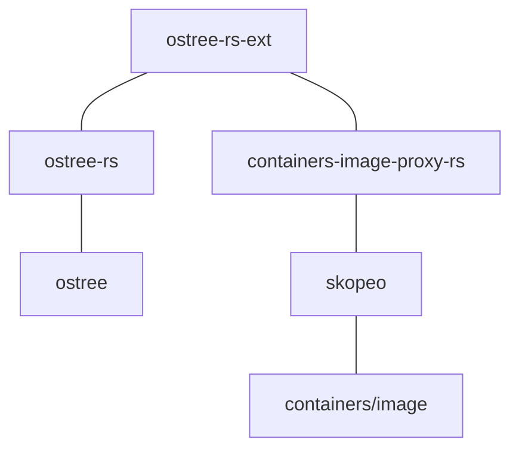

# ostree-ext

Extension APIs for [ostree](https://github.com/ostreedev/ostree/) that are written in Rust, using the [Rust ostree bindings](https://crates.io/crates/ostree).

If you are writing tooling that uses ostree and Rust, this crate is intended for you.
However, while the ostree core is very stable, the APIs and data models and this crate
should be considered "slushy".  An effort will be made to preserve backwards compatibility
for data written by prior versions (e.g. of tar and container serialization), but
if you choose to use this crate, please [file an issue](https://github.com/ostreedev/ostree-rs-ext/issues)
to let us know.

At the moment, the following projects are known to use this crate:

- https://github.com/containers/bootc
- https://github.com/coreos/rpm-ostree

The intention of this crate is to be where new high level ostree-related features
land.  However, at this time it is kept separate from the core C library, which
is in turn separate from the [ostree-rs bindings](https://github.com/ostreedev/ostree-rs).

High level features (more on this below):

- ostree and [opencontainers/image](https://github.com/opencontainers/image-spec) bridging/integration
- Generalized tar import/export
- APIs to diff ostree commits



For more information on the container stack, see below.

## module "tar": tar export/import

ostree's support for exporting to a tarball is lossy because it doesn't have e.g. commit
metadata.  This adds a new export format that is effectively a new custom repository mode 
combined with a hardlinked checkout.

This new export stream can be losslessly imported back into a different repository.

### Filesystem layout

```
.
├── etc                # content is at traditional /etc, not /usr/etc
│   └── passwd
├── sysroot       
│   └── ostree         # ostree object store with hardlinks to destinations
│       ├── repo
│       │   └── objects
│       │       ├── 00
│       │       └── 8b
│       │           └── 7df143d91c716ecfa5fc1730022f6b421b05cedee8fd52b1fc65a96030ad52.file.xattrs
│       │           └── 7df143d91c716ecfa5fc1730022f6b421b05cedee8fd52b1fc65a96030ad52.file
│       └── xattrs    # A new directory with extended attributes, hardlinked with .xattr files
│           └── 58d523efd29244331392770befa2f8bd55b3ef594532d3b8dbf94b70dc72e674
└── usr
    ├── bin
    │   └── bash
    └── lib64
        └── libc.so
```

Think of this like a new ostree repository mode `tar-stream` or so, although right now it only holds a single commit.

A major distinction is the addition of special `.xattr` files; tar variants and support library differ too much for us to rely on this making it through round trips.  And further, to support the webserver-in-container we need e.g. `security.selinux` to not be changed/overwritten by the container runtime.

## module "diff": Compute the difference between two ostree commits

```rust
    let subdir: Option<&str> = None;
    let refname = "fedora/coreos/x86_64/stable";
    let diff = ostree_ext::diff::diff(repo, &format!("{}^", refname), refname, subdir)?;
```

This is used by `rpm-ostree ex apply-live`.

## module "container": Bridging between ostree and OCI/Docker images


This module contains APIs to bidirectionally map between OSTree commits and the [opencontainers](https://github.com/opencontainers)
ecosystem.

Because container images are just layers of tarballs, this builds on the [`crate::tar`] module.

This module builds on [containers-image-proxy-rs](https://github.com/containers/containers-image-proxy-rs)
and [skopeo](https://github.com/containers/skopeo), which in turn is ultimately a frontend
around the [containers/image](https://github.com/containers/image) ecosystem.

In particular, the `containers/image` library is used to fetch content from remote registries,
which allows building on top of functionality in that library, including signatures, mirroring
and in general a battle tested codebase for interacting with both OCI and Docker registries.

### Encapsulation

For existing organizations which use ostree, APIs (and a CLI) are provided to "encapsulate"
and "unencapsulate" an OSTree commit as as an OCI image.

```
$ ostree-ext-cli container encapsulate --repo=/path/to/repo exampleos/x86_64/stable docker://quay.io/exampleos/exampleos:stable
```
You can then e.g.

```
$ podman run --rm -ti --entrypoint bash quay.io/exampleos/exampleos:stable
```

Running the container directly for e.g. CI testing is one use case.  But more importantly, this container image
can be pushed to any registry, and used as part of ostree-based operating system release engineering.

However, this is a very simplistic model - it currently generates a container image with a single layer, which means
every change requires redownloading that entire layer.  As of recently, the underlying APIs for generating
container images support "chunked" images.  But this requires coding for a specific package/build system.

A good reference code base for generating "chunked" images is [rpm-ostree compose container-encapsulate](https://coreos.github.io/rpm-ostree/container/#converting-ostree-commits-to-new-base-images).  This is used to generate the current [Fedora CoreOS](https://quay.io/repository/fedora/fedora-coreos?tab=tags&tag=latest)
images.

### Unencapsulate an ostree-container directly

A primary goal of this effort is to make it fully native to an ostree-based operating system to pull a container image directly too.

The CLI offers a method to "unencapsulate" - fetch a container image in a streaming fashion and
import the embedded OSTree commit.  Here, you must use a prefix scheme which defines signature verification.

- `ostree-remote-image:$remote:$imagereference`: This declares that the OSTree commit embedded in the image reference should be verified using the ostree remote config `$remote`.
- `ostree-image-signed:$imagereference`: Fetch via the containers/image stack, but require *some* signature verification (not via ostree).
- `ostree-unverified-image:$imagereference`: Don't do any signature verification

```
$ ostree-ext-cli container unencapsulate --repo=/ostree/repo ostree-remote-image:someremote:docker://quay.io/exampleos/exampleos:stable
```

But a project like rpm-ostree could hence support:

```
$ rpm-ostree rebase ostree-remote-image:someremote:quay.io/exampleos/exampleos:stable
```

(Along with the usual `rpm-ostree upgrade` knowing to pull that container image)


To emphasize this, the current high level model is that this is a one-to-one mapping - an ostree commit
can be exported (wrapped) into a container image, which will have exactly one layer.  Upon import
back into an ostree repository, all container metadata except for its digested checksum will be discarded.

#### Signatures

OSTree supports GPG and ed25519 signatures natively, and it's expected by default that
when booting from a fetched container image, one verifies ostree-level signatures.
For ostree, a signing configuration is specified via an ostree remote.  In order to
pair this configuration together, this library defines a "URL-like" string schema:
`ostree-remote-registry:<remotename>:<containerimage>`
A concrete instantiation might be e.g.: `ostree-remote-registry:fedora:quay.io/coreos/fedora-coreos:stable`
To parse and generate these strings, see [`OstreeImageReference`].

### Layering

A key feature of container images is support for layering.  This functionality is handled
via a separate [container/store](https://docs.rs/ostree_ext/latest/ostree_ext/container/store/) module.

These APIs are also exposed via the CLI:

```
$ ostree-ext-cli container image --help
ostree-ext-cli-container-image 0.4.0-alpha.0
Commands for working with (possibly layered, non-encapsulated) container images

USAGE:
    ostree-ext-cli container image <SUBCOMMAND>

FLAGS:
    -h, --help       Prints help information
    -V, --version    Prints version information

SUBCOMMANDS:
    copy      Copy a pulled container image from one repo to another
    deploy    Perform initial deployment for a container image
    help      Prints this message or the help of the given subcommand(s)
    list      List container images
    pull      Pull (or update) a container image
```

## More details about ostree and containers

See [ostree-and-containers.md](ostree-and-containers.md).
