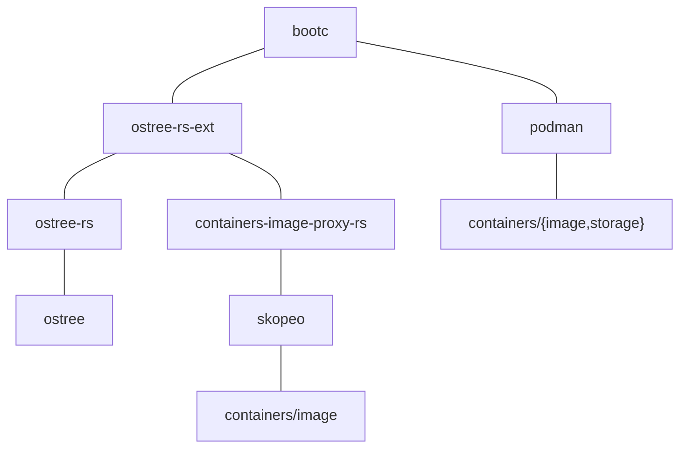

# Container storage

The bootc project uses [ostree](https://github.com/ostreedev/ostree/) and specifically
the [ostree-rs-ext](https://github.com/ostreedev/ostree-rs-ext/) Rust library
which handles storage of container images on top of an ostree-based system for
the booted host, and additionally there is a
[containers/storage](https://github.com/containers/storage) instance for [logically bound images](logically-bound-images.md).

## Architecture



There were two high level goals that drove the design of the current system
architecture:

- Support seamless in-place migrations from existing ostree systems
- Avoid requiring deep changes to the podman stack

A simple way to explain the current architecture is that podman uses
two Go libraries:

- <https://github.com/containers/image>
- <https://github.com/containers/storage>

Whereas ostree uses a custom container storage, not `containers/storage`.

## Mapping container images to ostree

[OCI images](https://github.com/opencontainers/image-spec) are effectively
just a standardized format of tarballs wrapped with JSON - specifically
"layers" of tarballs.

The ostree-rs-ext project maps layers to OSTree commits.  Each layer
is stored separately, under an ostree "ref" (like a git branch)
under the `ostree/container/` namespace:

```
$ ostree refs ostree/container
```

### Layers

The `ostree/container/blob` namespace tracks storage of a container layer
identified by its blob ID (sha256 digest).

### Images

At the current time, ostree always boots into a "flattened" filesystem
tree.  This is generated as both a hardlinked checkout as well as
a composefs image.

The flattened tree is constructed and committed into the 
`ostree/container/image` namespace.  The commit metadata also includes
the OCI manifest and config objects.

This is implemented in the [ostree-rs-ext/container module](https://docs.rs/ostree-ext/latest/ostree_ext/container/index.html).

### SELinux labeling

A major wrinkle is supporting SELinux labeling.  The labeling configuration
is defined as regular expressions included in `/etc/selinux/$policy/contexts/`.

The current implementation relies on the fact that SELinux labels for
base images were pre-computed.  The first step is to check out the "ostree base"
layers for the base image.

All derived layers have labels computed from the base image policy.  This
causes a known bug where derived layers can't include custom policy:
<https://github.com/ostreedev/ostree-rs-ext/issues/510>

### Origin files

ostree has the concept of an `origin` file which defines the source
of truth for upgrades.  The container image reference for each deployment
is included in its origin.

## Booting

A core aspect of this entire design is that once a container image is
fetched into the ostree storage, from there on it just appears as
an "ostree commit", and so all code built on top can work with it.

For example, the `ostree-prepare-root.service` which runs in
the initramfs is currently agnostic to whether the filesystem tree originated
from an OCI image or some other mechanism; it just targets a
prepared flattened filesystem tree.

This is what is referenced by the `ostree=` kernel commandline.

## Logically bound images

In addition to the base image, bootc supports [logically bound images](logically-bound-images.md).
